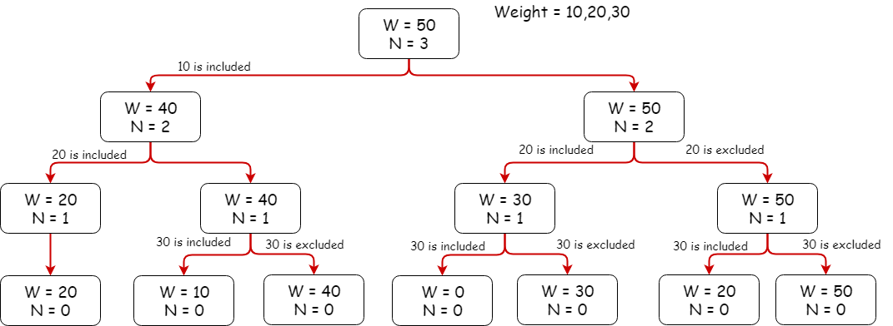
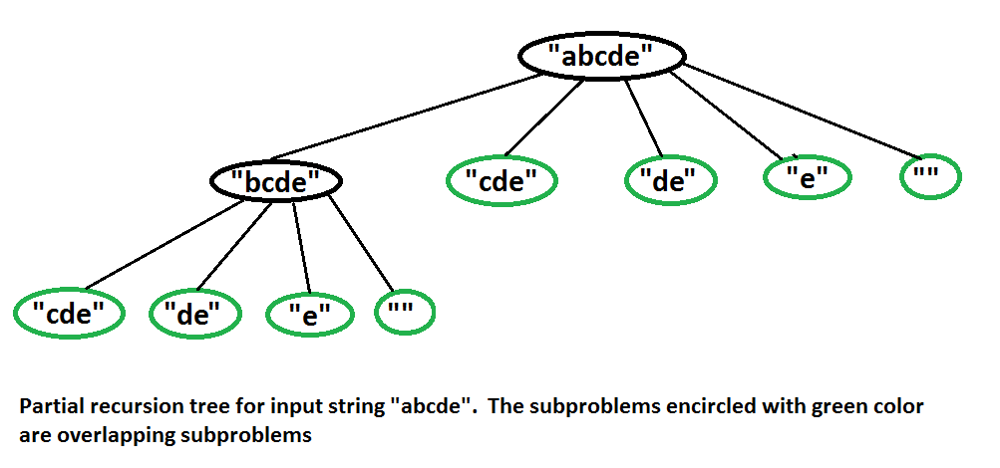

## Dynamic Programming Problems

#### How to solve DP problems

1. Identify if it is a DP problem
2. Decide a state expression with
   least parameters
3. Formulate state relationship
4. Recursively define problem, then solve it

#### Knapsack problem

The knapsack problem is defined as:

Given a set of items, each with a weight and a value, determine the number of each item to include in a collection so that the total weight is less than or equal to a given limit and the total value is as large as possible.

#### Word Break problem

The word break problem defined as:

Given an input string and a dictionary of words, find out if the input string can be segmented into a space-separated sequence of dictionary words. See following examples for more details.

worked on this with William Bogans